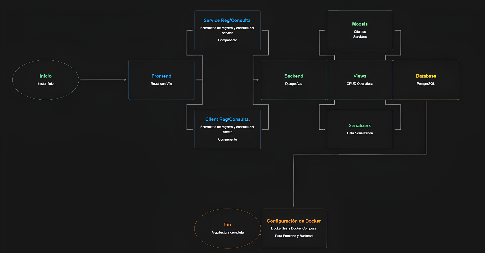

# 1. PRUEBA TÉCNICA DESARROLLO

## DESCRIPCIÓN DEL PROBLEMA

La empresa Celsia Internet S.A.S. requiere implementar una solución para su proceso de venta que permita la captura de información de los clientes y la contratación de uno o varios servicios del portafolio de internet.

El ejercicio consiste en implementar un backend y frontend con su configuración de despliegue en contenedores, para el registro y consulta de la información de los servicios contratados por los clientes, de acuerdo con el modelo de datos presentado a continuación.

## MODELO DE DATOS

Las tablas donde se almacena la información son las siguientes:

```console
CREATE TABLE clientes {
  identificacion VARCHAR(20) NOT NUL PRIMARY KEY,
  nombres VARCHAR(80) NOT NULL,
  apellidos VARCHAR(80) NOT NULL,
  tipoIdentificacion VARCHAR(2) NOT NULL,
  fechaNacimiento DATE NOT NULL,
  numeroCelular VARCHAR(20) NOT NULL,
  correoElectronico VARCHAR(80) NOT NULL
};


CREATE TABLE servicios {
  identificacion VARCHAR(20) NOT NUL,
  servicio VARCHAR(80) NOT NUL,
  fechaInicio DATE NOT NULL,
  ultimaFacturacion DATE NOT NULL,
  ultimoPago INTEGER NOT NUL DEFAULT 0,
  PRIMARY KEY (identificacion, servicio),
  CONSTRAINT servicios_FK1 FOREING KEY (identificacion) REFERENCES clientes(identificacion) ON UPDATE CASCADE ON DELETE NO ACTION
}
```

Para la prueba se deben crear las tablas en el motor de base de datos de su preferencia. Sobre esta base se deben almacenar los registros de los clientes y servicios que se especifican para la prueba.

## Puntos de la prueba

1.1. Implemente en el lenguaje de su preferencia, una `CRUD (Create, Read, Update and Delete)` que permita capturar y administrar la información de los clientes y sus servicios.

1.2. Se deben realizar las siguientes validaciones:

- No dejar datos en blanco.
- El tipo de dato, de acuerdo con la estructura en la base de datos.
- Si el registro ya existe muestre el mensaje `“El registro ya existe”`.

  1.3. Implementar un formulario que permita registrar los servicios contratados de los clientes. `Nota: Tener en cuenta integridad referencial.`

  1.4. Implementar un formulario para la consulta por número de identificación, la información de un cliente y los servicios que tiene contratados.

TIPS:

a. Para el campo `tipoIdentificacion` ingresar solamente los siguientes valores:

- CEDULA → CC
- TARJETA IDENTIDAD → TI
- CEDULA EXTRANJERIA → CE
- REGISTRO CIVIL → RC

b. Para el campo `servicio` ingresar solamente los siguientes tipos:

- Internet 200 MB
- Internet 400 MB
- Internet 600 MB
- Directv Go
- Paramount+
- Win+

c. Se evaluará el uso de patrones de diseño, en backend y frontend, la configuración de despliegue en contenedores y de la imagen a desplegar.

d. En el docker-compose se debe incluir la configuración del servicio de base de datos que haya escogido y una política de manejo de logs para cada servicio.

## ENTREGABLE

Se espera como resultado un clone del repositorio `https://github.com/celsia-internet/pruebas.git`, con la siguiente estructura.

```
api/
|-- docker-compose.yml
|-- Dockerfile
|-- README.md
|-- ...
webapp/
|-- docker-compose.yml
|-- Dockerfile
|-- README.md
|-- ...
```

El repositorio de la prueba deberá estar publicado en `github` de manera pública con el nombre `prueba-celsia-internet` usando git-flow por desarrollador.

```
main/
|-- develop
||-- <desarrollador>
```

# 2. PRUEBA TEORICO-PRACTICA

Para el desarrollo de la prueba teórica, tendrás que escribir tus respuestas en el archivo README.md del repositorio, tomando como referencia la aplicación desarrollada en la `PRUEBA TÉCNICA DE DESARROLLO`.

## PREGUNTAS

2.1. Elabore un diagrama de componentes de la aplicación. Debe cargar el archivo en la siguiente ruta del repositorio: `./assets/diagrama.png`

- RTA: 

  2.2. ¿Qué mecanismos de seguridad incluirías en la aplicación para garantizar la protección del acceso a los datos?

- RTA:
  1 Autenticación de usuarios a dos pasos 
  2 Control de acceso basado en roles 
  3 Auditoría y monitoreo de logs 
  4 Seguridad en las API como autenticacion y autorizacion dependiendo lo que este solicitando 
  5 Actualizaciones 
  6 Monitoreo

  2.3. ¿Qué estrategia de escalabilidad recomendarías para la aplicación considerando que el crecimiento proyectado será de 1,000,000 de clientes por año?

- RTA: 
  1. Arquitectura de microservicios 
  2. Escalado horizontal 
  3. Procesamiento asíncrono 
  4. Optimización de consultas 
  5. Almacenamiento en la nube 
  6. Monitoreo 
  7. Estrategia de caché 
  8. Optimización de código 
  9. Pruebas de carga

  2.4. ¿Qué patrón o patrones de diseño recomendarías para esta solución y cómo se implementarían? (Justifique)

- RTA:
  1. Patrón MVC, Justificación: Este patrón ya está implícito en la estructura del diagrama. 
  2. Patrón Factory, Justificación: Útil para la creación de objetos complejos como clientes o servicios.

  2.5. ¿Qué recomendaciones harías para optimizar el manejo y la persistencia de datos de la aplicación, teniendo en cuenta que esta aplicación tiene una alta transaccionalidad?

- RTA:
  1. Uso de bases de datos optimizadas para transacciones 
  2. Implementación de índices eficientes en bd 
  3. Uso de procedimientos almacenados 
  4. Optimización de consultas 
  5. Implementación de caching 
  6. Arquitectura de lectura/escritura separada 
  7. Manejo eficiente de conexiones 
  8. Monitoreo y ajuste continuo 
  9. Estrategia de backup y recuperación 
  10. Uso de tecnologías NoSQL para reporteria

# 3. Redes

3.1. Explica la diferencia entre un router y un switch. ¿Cuándo usarías cada uno?

- RTA:
  El router se encarga de manejar el tráfico de datos entre redes diferentes en casa, cuando se desea conectar a internet El switch trabaja dentro de una sola red local, Su trabajo es conectar varios dispositivos en la misma red y dirigir los datos entre ellosm se puede usar un switch cuando quieras ampliar una red local y conectar varios dispositivos dentro de esa misma red.

  3.2. Describe las siete capas del modelo OSI y menciona brevemente la función principal de cada una

- RTA:
  1. Física transmite bits a través del medio físico (cables, fibra óptica, ondas de radio) 
  2. Enlace de Datos: Maneja tramas y direcciones MAC; detecta y corrige errores en la transmisión de datos. 
  3. Red: Encaminamiento de paquetes entre redes usando direcciones IP. 
  4. Transporte: Garantiza la entrega correcta y fiable de datos; maneja el control de flujo y la corrección de errores (TCP/UDP). 
  5. Presentación: Traduce, codifica y cifra los datos para la capa de aplicación. 
  6. Aplicación: Proporciona servicios de red a las aplicaciones (HTTP, FTP, SMTP).

  3.3. Explica las diferencias entre los protocolos TCP y UDP. Dar un ejemplo de cuándo usarías cada uno?

- RTA:

  Diferencias Entre TCP y UDP
  Confiabilidad:

  TCP: Asegura que los datos lleguen correctamente y en orden, reenvía si es necesario.
  UDP: No garantiza la entrega ni el orden de los datos.
  Conexión:

  TCP: Establece una conexión antes de enviar datos.
  UDP: Envía datos sin establecer conexión previa.
  Velocidad:

  TCP: Más lento, debido a comprobaciones.
  UDP: Más rápido, sin comprobaciones adicionales.
  Ejemplos de Uso:

  TCP: Navegación web, correos electrónicos.
  UDP: Streaming en vivo, juegos en línea.

  3.4. ¿Qué es una máscara de subred y cómo se utiliza para dividir una red en subredes más pequeñas?

- RTA:
  La máscara de subred ayuda a dividir una red grande en subredes más pequeñas. Esto organiza las direcciones IP en grupos manejables y mejora la administración de la red. En la práctica, cambiar la máscara de subred permite crear subredes que se ajusten mejor a tus necesidades de red.

  ¿Cómo Usar una Máscara de Subred?

  1. Identifica la Red y Máscara Original: Ejemplo: 192.168.1.0 con máscara 255.255.255.0 (o /24).

  2. Decide Cuántas Subredes Necesitas: Supongamos que necesitas 4 subredes.

  3. Calcula la Nueva Máscara: Para 4 subredes, usa 255.255.255.192 (o /26).

  4. Divide la Red:

    - Subred 1: 192.168.1.0/26 (IPs de 192.168.1.1 a 192.168.1.62)
    - Subred 2: 192.168.1.64/26 (IPs de 192.168.1.65 a 192.168.1.126)
    - Subred 3: 192.168.1.128/26 (IPs de 192.168.1.129 a 192.168.1.190)
    - Subred 4: 192.168.1.192/26 (IPs de 192.168.1.193 a 192.168.1.254)
  5. Configura los Dispositivos de Red: Ajusta routers y switches para manejar las nuevas subredes.


  3.5. ¿Puedes mencionar algunos protocolos de enrutamiento dinámico y explicar brevemente cómo funcionan?

- RTA:
  Protocolos de Enrutamiento Dinámico
  RIP: Usa el número de saltos para encontrar rutas. Bueno para redes pequeñas.
  OSPF: Calcula rutas basadas en costos. Ideal para redes grandes.
  EIGRP: Combina métodos para encontrar rutas rápidamente. Útil en redes medianas a grandes.
  BGP: Enruta entre diferentes redes grandes (como Internet). Maneja el enrutamiento entre proveedores.

### Por último, y no menos importante, te deseamos mucha suerte y esperamos que disfrutes haciendo la prueba. El objetivo es evaluar tu conocimiento, capacidad de adaptabilidad y habilidad para resolver problemas.
